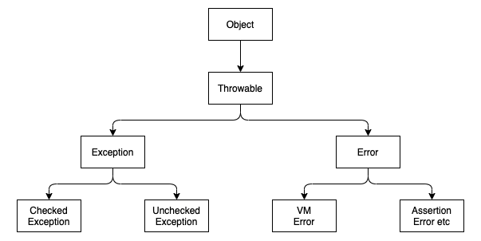
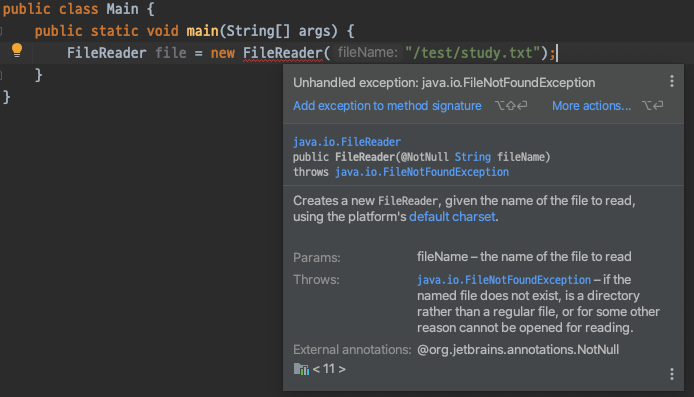
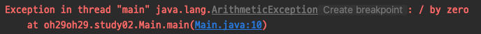

# Java Exception

예외는 어플리케이션 런타임에 원하지 않거나 예상하지 못한 채 발생하는 이벤트로, 어플리케이션의 정상적인 흐름을 방해한다.  

## Error vs Exception

#### Error

오류는 어플리케이션에서 처리할 수 없는 심각한 문제를 나타낸다.  
즉, 어떤 처리 방법으로도 복구할 수 없는 상태이다.  

어플리케이션의 비정상적 종료의 원인이 되며, unchecked 유형이고 대부분 런타임에 발생한다.

#### Exception

예외는 어플리케이션 런타임에 발생하는 어떤 상태를 의미하며 어플리케이션이 종료될 수 있다.  
다만, try, catch 및 throw 키워드를 사용하여 복구할 수 있다는 것이 오류와의 큰 차이점이다.  

|Errors|Exceptions|
|------|----------|
|복구가 불가능하다.|try-catch 블럭을 사용하거나 호출자에게 예외를 던져 복구할 수 있다.|
|모든 오류는 unchecked 유형이다.|checked 유형과 unchecked 유형이 있다.|
|대부분의 오류는 런타임 중 환경적인 요인으로 발생한다.|어플리케이션 자체에서 예외가 발생한다.|
|컴파일 단계에서 알 수 없다.|checked 유형인 경우 컴파일 단계에서 알 수 있다.|
|`java.lang.Error` 패키지에 정의되어 있다.|`java.lang.Exception` 패키지에 정의되어 있다.|

#### 공통점

오류와 예외는 모두 `java.lang.Throwable` 클래스의 하위 클래스이다.

## Hierarchy



## Checked vs Unchecked

#### Checked

컴파일 단계에서 확인이 되어 미리 알 수 있는 예외이다.  
메서드 내의 일부 코드에서 확인된 예외가 발생하면 메서드는 try-catch 문을 사용하여 예외를 처리하거나 throws 키워드를 사용하여 예외를 지정해야한다.  



예를 들어, 위와 같이 FileReader() 를 사용할때는 컴파일 단계에서 어떤 예외가 발생할 수 있는지 확인이 가능하다.    
따라서 FileReader() 를 사용하려면 FileNotFoundException 이라는 예외를 try-catch 문을 사용해 처리하거나 throws 키워드를 사용해 지정해줘야 한다. 

```java
public class Main {
    public static void main(String[] args) throws FileNotFoundException {
        FileReader file = new FileReader("/test/study.txt");
    }
}
```

#### Unchecked

컴파일 단계에서 확인이 되지 않아 런타임에서만 알 수 있는 예외이다.  

```java
public class Main {
    public static void main(String[] args) {
        int x = 0;
        int y = 10;
        int z = y / x;
    }
}
```

위와 같은 어플리케이션이 존재한다고 할 때, 컴파일은 이상없지 되지만 실행하면 `java.lang.ArithmeticException` 이 발생한다.



컴파일러는 `java.lang.ArithmeticException` 이 unchecked 예외이기 때문에 컴파일을 허용한다.

<hr>

#### References

> 웹 문서
> - [geeksforgeeks | Exceptions in Java](https://www.geeksforgeeks.org/exceptions-in-java)
> - [geeksforgeeks | Checked vs Unchecked Exceptions in Java](https://www.geeksforgeeks.org/checked-vs-unchecked-exceptions-in-java)
> - [geeksforgeeks | Java Program to Handle Unchecked Exception](https://www.geeksforgeeks.org/java-program-to-handle-unchecked-exception)
> - [geeksforgeeks | Java Program to Handle Runtime Exceptions](https://www.geeksforgeeks.org/java-program-to-handle-runtime-exceptions)
> - [geeksforgeeks | Errors V/s Exceptions In Java](https://www.geeksforgeeks.org/errors-v-s-exceptions-in-java/)
> - [geeksforgeeks | Flow control in try catch finally in Java](https://www.geeksforgeeks.org/flow-control-in-try-catch-finally-in-java/)
> - [geeksforgeeks | throw and throws in Java](https://www.geeksforgeeks.org/throw-throws-java/)
> - [geeksforgeeks | Built-in Exceptions in Java with examples](https://www.geeksforgeeks.org/built-exceptions-java-examples/)
